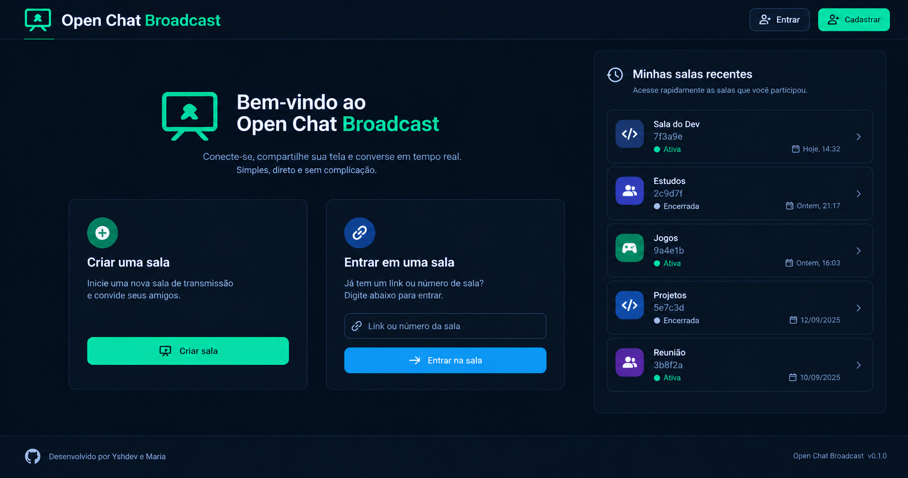

# Criar tela Inicial
Criar a estrutura visual inicial da tela inicial da aplicacao, mantendo o padrao de estilos ja definidos pela equipe.

* A tela deve seguir o padrao de estilos ja definido na tela de salas (rooms).
* Permitir criar novas salas
* Permitir Entrar em sala existente
* Botoes de login/cadastro devem ser adicionados no canto superior direito da tela
* Exibir Icone Github que leve a pagina principal dos contribuintes do projeto
   * Devem ser Exibidos 2 Icones, um para cada participante (AlvaroJPP e ysh-rael)
* Exibir card com "Ultimas Salas acessadas"
  * Exibir data de Acesso
  * Exibir Icone de sala ativa/inativa
  * Exibi avatar para tipo de sala (definido ao criar sala)  
* Mensagem de Bem-Vindo
* Exibir Titulo da Aplicacao

---
Imagem Exemplo Gerada por IA

--- 
Em anexo sera enviado a estrutura dos modelos do banco.
Implemente usando mockas no padrao dos modelos. mas implemente tambem consultas para o backend utilizando `/api/...` e adicione uma flag para alternar entre usar o mocka ou os dados do servidor.
